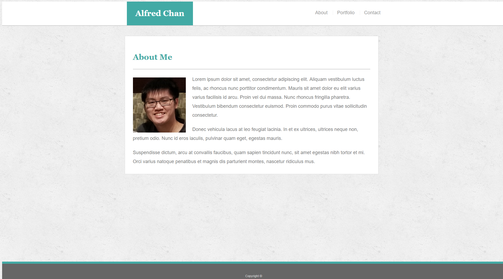
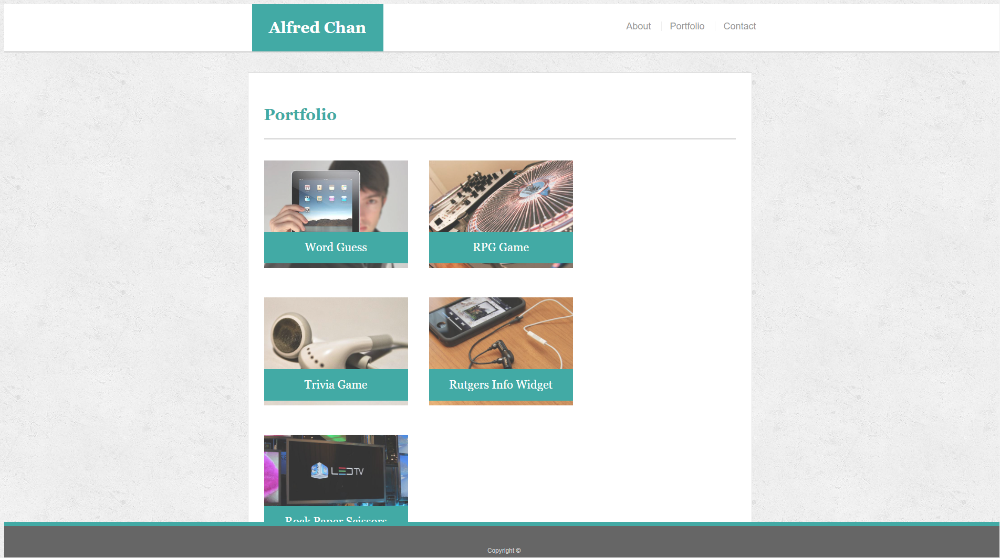
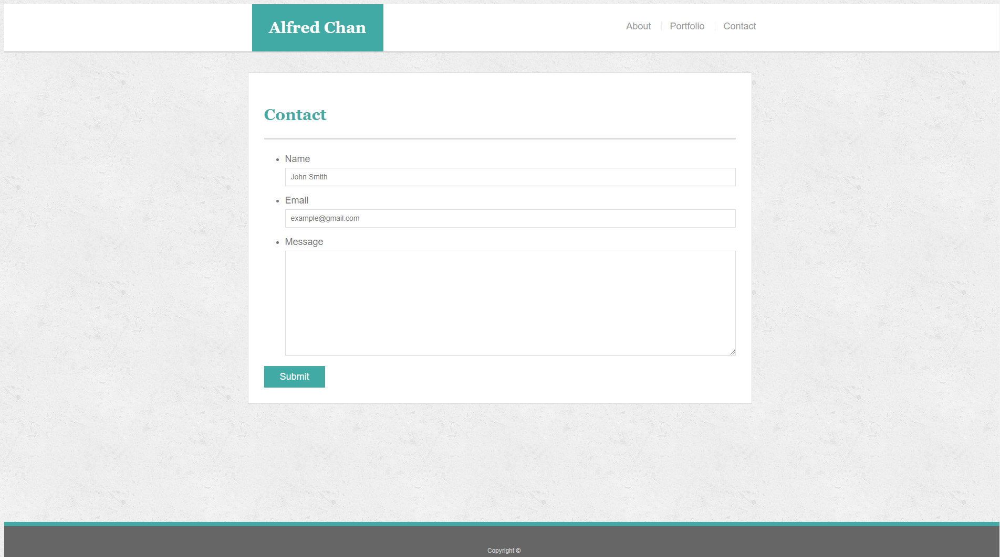

# Responsive-Portfolio

This is a design of a portfolio page using responsive elements that scale according to monitor resolution. The design is based on [a prior assignment](https://github.com/b0bland/Basic-Portfolio).

## Technologies Used

* HTML
* CSS

## Authors

* Alfred Chan
